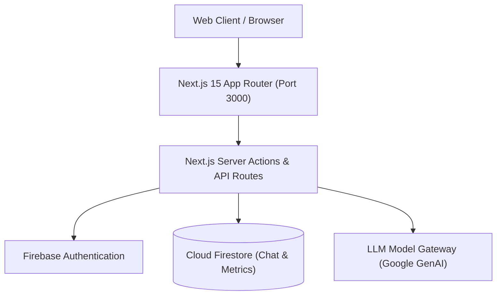
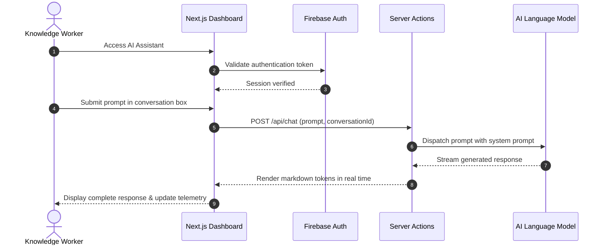

# AI-Assistant & Analytics Dashboard — Conversational Workspace

[]()
[]()
[]()

## Overview
AI-Assistant is an enterprise conversational AI workspace and operational telemetry dashboard engineered with Next.js 15, React, Tailwind CSS, and Firebase. It provides conversational AI query execution, document-augmented chat, and real-time business telemetry.

## Features
- **Streaming Conversational Assistant:** Fluid multi-turn chat feed with dynamic markdown rendering and code syntax highlighting.
- **Real-Time Operational Analytics:** Interactive charts detailing daily query volumes, token consumption metrics, and response latencies.
- **Multi-Tenant User Authentication:** Firebase Auth integration supporting email/password and social OAuth login.
- **Modern Responsive Design System:** Accessible component architecture built with Radix UI and Tailwind CSS.

## Architecture


## User Flow


## Technology Stack
| Layer | Technology | Purpose |
|---|---|---|
| Framework | Next.js 15 (App Router) | Enterprise React application framework |
| Language | TypeScript | Strong typing and domain contracts |
| UI & Icons | Tailwind CSS, Radix UI, Lucide | Design tokens and component primitives |
| Identity & DB | Firebase Auth, Firestore | User authentication and document storage |

## Infrastructure
- **Server Port:** 3000 (Next.js App Server)
- **Cloud Backend:** Google Cloud Platform & Firebase Services
- **Hosting Target:** Vercel / Firebase App Hosting

## Project Structure
```text
AI-Assistant/
├── src/
│   ├── app/             # App Router pages (chat, dashboard, settings)
│   ├── components/      # ChatBubble, AnalyticsChart, Sidebar, Navbar
│   ├── context/         # AuthContext and state providers
│   ├── firebase/        # config.ts (Firebase client initialization)
│   └── lib/             # Utility and helper functions
├── next.config.ts       # Next.js build configuration
├── package.json         # Project dependencies
├── .env.example         # Environment template
├── .gitignore           # Git ignore definitions
└── README.md            # Technical documentation
```

## Prerequisites
- Node.js >= 18.x
- npm >= 9.x
- Active Firebase Project

## Environment Variables
Copy `.env.example` to `.env.local` and configure placeholders:
```env
NEXT_PUBLIC_FIREBASE_API_KEY=your_firebase_api_key_here
NEXT_PUBLIC_FIREBASE_PROJECT_ID=your_project_id_here
NEXT_PUBLIC_FIREBASE_APP_ID=your_app_id_here
NEXT_PUBLIC_FIREBASE_AUTH_DOMAIN=your_project.firebaseapp.com
NEXT_PUBLIC_FIREBASE_MESSAGING_SENDER_ID=your_sender_id_here
```

## Local Development Setup
1. Clone the repository:
   ```bash
   git clone https://github.com/Bhanutejanallamothu/AI-Assistant.git
   cd AI-Assistant
   ```
2. Install dependencies:
   ```bash
   npm install
   ```
3. Set up environment:
   ```bash
   cp .env.example .env.local
   ```
4. Start development server:
   ```bash
   npm run dev
   ```
5. Navigate to `http://localhost:3000`.

## Docker Setup
*Not detected in repository. Standard Next.js standalone containerization supported.*

## Database Setup
Initialize Cloud Firestore collections (`conversations`, `messages`, `analytics`) via Firebase Console.

## API Documentation
- `POST /api/chat` - Dispatches prompt to LLM and streams response.
- `GET /api/analytics` - Retrieves aggregated query telemetry.

## Deployment
Deploy to Vercel or Firebase App Hosting:
```bash
npm run build
```

## Security
- Externalized Firebase credentials via environment variables.
- Role-based route guarding preventing unauthenticated access to chat history.
- Markdown sanitization to eliminate Cross-Site Scripting (XSS) risks.

## Testing
Run linter:
```bash
npm run lint
```

## Troubleshooting
- **Firebase Auth Error:** Ensure `localhost` is listed under Authorized Domains in Firebase Console > Authentication > Settings.

## Future Improvements
- Multi-modal file attachments (PDF parsing, audio transcription).
- Collaborative team workspaces with shared conversation threads.

## License
All rights reserved by repository owner.
